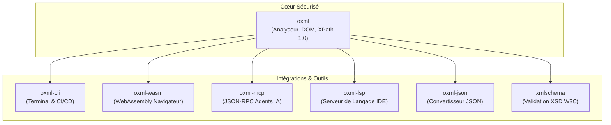
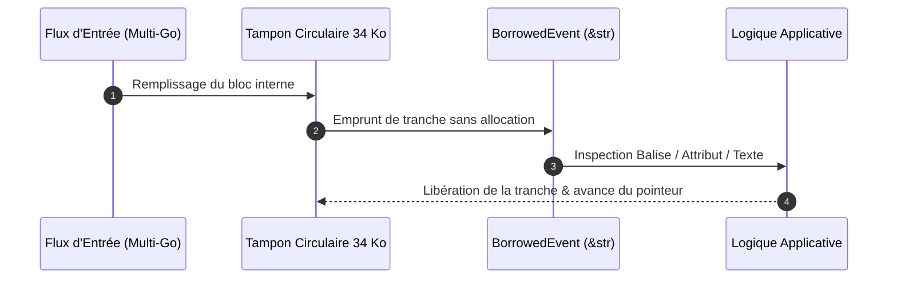

## Règle Zéro Unsafe

`oxml` applique strictement `#![forbid(unsafe_code)]` à la racine de tous les crates de l'espace de travail. Zéro exception :

- Zéro arithmétique de pointeurs bruts
- Zéro transmute non vérifié
- Zéro accès non contrôlé aux tranches

Toutes les vérifications de bornes sont garanties au niveau du compilateur.

## Allocation en Arène

`oxml::Document` repose sur une arène de nœuds à recyclage générationnel :

- **Accès O(1) :** Les nœuds sont référencés par des identifiants `NodeId` compacts et copiables.
- **Recyclage Générationnel :** Les suppressions incrémentent un compteur de génération, évitant toute corruption de mémoire.
- **Localité de Cache :** Stockage contigu en mémoire maximisant l'efficacité des caches L1/L2 du processeur.

## Accélération SWAR

Le balayage rapide de délimiteurs s'appuie sur la technique SWAR (SIMD Within A Register) par blocs de 8 octets, doublant le débit sans aucune instruction unsafe.

## Architecture de l'Écosystème

L'écosystème `oxml` est articulé en crates découplés partageant le même cœur sécurisé :

## Emprunt en Flux Zéro-Copie

Pour les flux de données à très haut débit nécessitant l'élimination des allocations mémoire :

- `Reader::next_borrowed()` produit des événements `BorrowedEvent<'a>` qui empruntent directement les tranches de chaînes (`&str`) depuis le tampon interne.
- Nœuds de texte, noms de balises et attributs sont inspectés sans duplication sur le tas.
- Garantit une empreinte mémoire bornée à 34 Ko lors de l'ingestion de flux de plusieurs gigaoctets.

